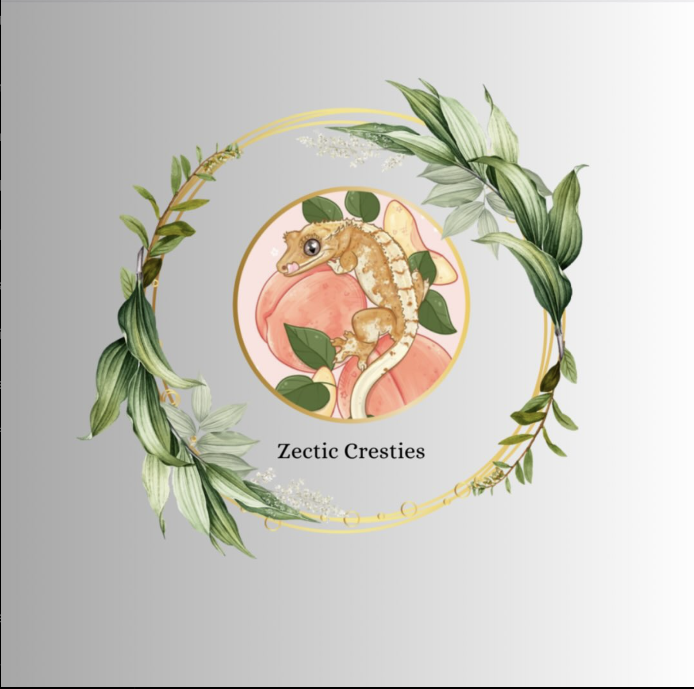

# Zectic Cresties - Crested Gecko Breeding Facility



## Overview

Zectic Cresties is a family-based crested gecko breeding facility dedicated to producing healthy, high-quality geckos with stunning genetics and vibrant colors. This repository contains the complete web application built with Flask to showcase our geckos and provide information to gecko enthusiasts.

## Features

- **Responsive Design**: Mobile-friendly layout with collapsible sidebar navigation
- **Home Page**: Showcases featured geckos and provides quick access to our catalog
- **About Page**: Detailed information about our breeding practice and commitment to quality
- **Contact Form**: Easy-to-use contact form with email functionality
- **Image Gallery**: Display of our beautiful gecko collection with modal image viewer

## Technology Stack

- **Backend**: Flask (Python web framework)
- **Frontend**: HTML5, CSS3, JavaScript
- **Styling**: Bootstrap 4, Font Awesome icons
- **Form Handling**: Flask-WTF, Flask-Mail
- **Deployment**: Ready for deployment on any WSGI-compatible server

## Installation and Setup

1. Clone the repository:
   ```bash
   git clone https://github.com/yourusername/zectic_cresties.git
   cd zectic_cresties
   ```

2. Create and activate a virtual environment:
   ```bash
   python -m venv venv
   source venv/bin/activate  # On Windows, use: venv\Scripts\activate
   ```

3. Install required packages:
   ```bash
   pip install -r requirements.txt
   ```

4. Configure email settings:
   - Update email configuration in `app/__init__.py` with your SMTP server details

5. Run the application:
   ```bash
   python run.py
   ```

6. Access the website at `http://localhost:5000`

## Project Structure

```
zectic_cresties/
├── app/
│   ├── __init__.py         # Flask application initialization
│   ├── forms.py            # Form definitions using Flask-WTF
│   ├── routes.py           # Application routes
│   ├── static/             # Static assets
│   │   ├── assets/         # Images and media files
│   │   ├── script.js       # JavaScript functionality
│   │   └── style.css       # Custom CSS styling
│   └── templates/          # HTML templates
│       ├── about.html
│       ├── base.html
│       ├── contact_us.html
│       └── home.html
├── venv/                   # Virtual environment (not in repository)
├── .gitignore
├── README.md
├── requirements.txt
└── run.py                  # Application entry point
```

## Customization

- **Colors**: The primary color scheme uses `#B8860B` (dark goldenrod) which can be modified in the CSS files
- **Content**: Update text content in the HTML templates
- **Images**: Replace images in the `app/static/assets/media/` directory with your own gecko photos

## Contributing

1. Fork the repository
2. Create a feature branch (`git checkout -b feature/amazing-feature`)
3. Commit your changes (`git commit -m 'Add some amazing feature'`)
4. Push to the branch (`git push origin feature/amazing-feature`)
5. Open a Pull Request

## License

This project is licensed under the MIT License - see the LICENSE file for details.

## Contact

For any inquiries, please reach out through the website's contact form or via:
- Instagram: [@zectic_cresties](https://www.instagram.com/zectic_cresties)
- Email: thnsjnr.okelly33@gmail.com

---

© 2025 Zectic Cresties. All Rights Reserved.